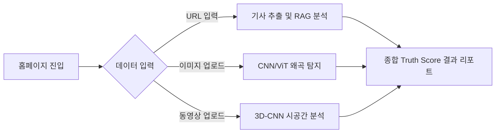
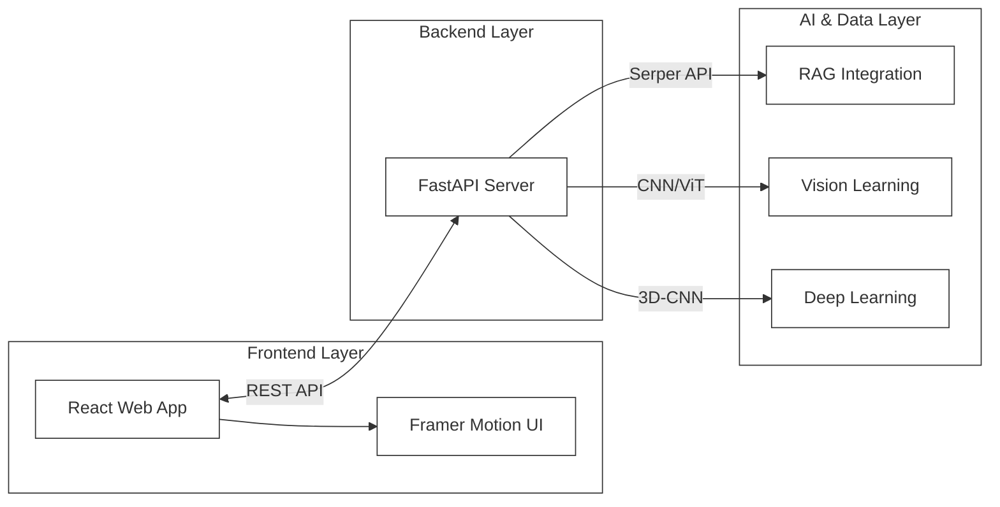
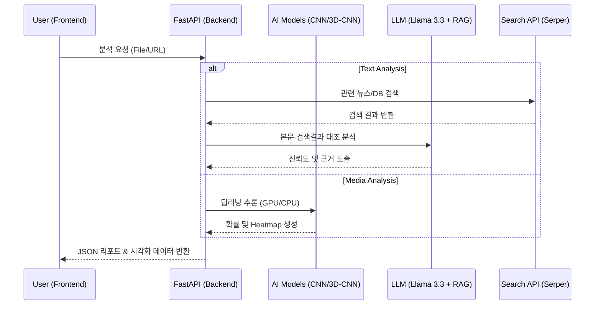
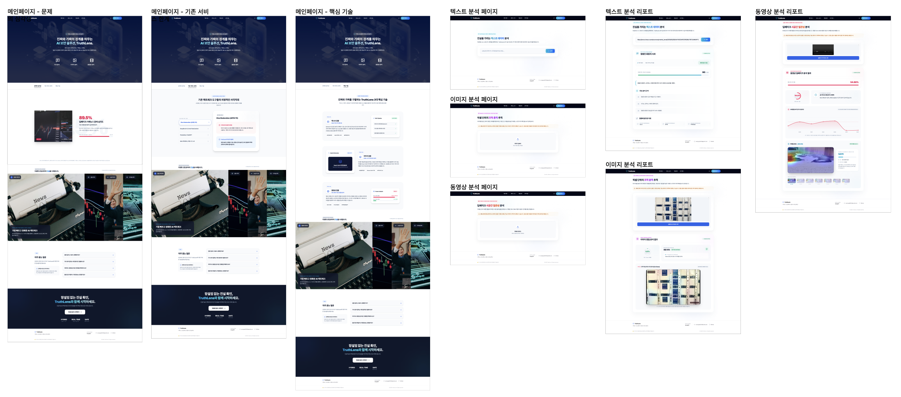

# TruthLens
### AI-Powered Multi-modal Fact-Checking Platform

  

    <strong>"가짜를 만드는 기술로, 진실을 보는 눈을 제작하다."</strong> 
    AI-generated misinformation is rising. TruthLens is the counter-measure.
  

    
  

    
    
  

---

## 프로젝트 개요 (Project Overview)
**TruthLens**는 생성형 AI의 발전으로 육안 구별이 불가능해진 딥페이크 이미지, 영상, 정교한 가짜 뉴스로부터 사회적 신뢰를 회복하기 위해 탄생했습니다. 픽셀(CNN), 프레임(3D-CNN), 사실 관계(RAG)라는 **3중 레이어 검증 시스템**을 통해 디지털 콘텐츠의 진위를 판별합니다.

## 핵심 검증 시스템 (Key Features)

### 뉴스 기사 팩트체크 (RAG Engine)
단순한 문맥 파악을 넘어, 실시간으로 신뢰할 수 있는 정보와 대조합니다.
- **RAG(Retrieval-Augmented Generation)**: LLM(Llama 3.3)이 기사의 핵심 주장을 추출하고, Serper API를 통해 공공기관/언론사 DB에서 정보를 검색하여 교차 검증합니다.
- **출력**: 진실/거짓/판단보류 판정 및 근거 자료 리스트 제공.

### 이미지 조작 탐지 (Vision Engine)
이미지의 주파수 영역과 전역적 문맥을 동시에 분석합니다.
- **CNN & ViT 하이브리드**: `EfficientNet-B0`로 미세한 픽셀 왜곡을 감지하고, Vision Transformer로 광원 불일치 등 구조적 부자연스러움을 포착합니다.
- **출력**: 조작 의심 영역 **Heatmap(CAM)** 시각화 및 위조 확률(%).

### 동영상 딥페이크 탐지 (Video Analysis)
이미지의 연속성을 넘어 '시공간 일관성'을 추적합니다.
- **3D-CNN**: 시간(Time) 축을 포함한 3차원 필터 분석으로 프레임 간의 미세한 떨림(Flickering)과 부자연스러운 변화를 탐지합니다.
- **출력**: 타임라인별 위험도 그래프 및 변조 의심 구간 로그.

---

## 사용자 흐름 및 시스템 구조

### User Flow

사용자는 직관적이고 단순한 인터페이스를 통해 복잡한 멀티모달 분석을 수행할 수 있습니다.

1.  **데이터 입력 (Multi-modal Input)**: 뉴스 기사 URL, 이미지 파일(PNG/JPG), 또는 동영상 링크를 업드로드합니다.
2.  **지능형 분석 (AI Analysis)**: 입력된 데이터 유형에 따라 RAG 기반 팩트체크, CNN/ViT 하이브리드 이미지 분석, 또는 3D-CNN 시공간 비디오 분석이 자동으로 실행됩니다.
3.  **종합 리포트 (Intelligence Report)**: 분석 결과를 시각화하여 'Truth Score'와 함께 판독 근거, 조작 의심 영역(Heatmap), 변조 타임라인 등을 포함한 상세 리포트를 제공합니다.

### System Architecture

TruthLens의 아키텍처는 효율적인 연산 처리와 확장성을 위해 계층형 구조(Layered Architecture)를 채택했습니다.

#### Architecture Overview
- **Frontend Layer**: React 19와 Framer Motion을 사용하여 고성능 인터랙티브 UI를 구현하고, 사용자 입력을 처리합니다.
- **Backend Layer**: FastAPI를 기반으로 비동기 API 서버를 구축하여 고부하 AI 추론 작업을 효율적으로 오케스트레이션합니다.
- **AI & Data Layer**: 최신 LLM(Lama 3.3)과 Deep Learning 모델(CNN, ViT)을 활용하여 사실 관계 검증 및 미디어 위조를 정밀 탐지합니다.

#### Interaction Flow
데이터가 시스템 각 계층을 거치며 검증되는 상세 프로세스입니다.

1.  **Request**: 프론트엔드에서 분석을 요청하면 백엔드에서 데이터 유형을 식별합니다.
2.  **Verification**: 텍스트 데이터의 경우 실시간 검색(Serper API)과 LLM(RAG)을 통해 팩트체크를 수행하며, 미디어 데이터는 딥러닝 엔진으로 왜곡 패턴을 추론합니다.
3.  **Response**: 최종적으로 수치화된 확률 데이터와 시각적 증거(Heatmap 등)를 JSON 형태로 결합하여 유저에게 반환합니다.

---

## UI 설계 (Interface Design)

  

---

## 기술 스택 (Technical Stack)

| 구분 | 기술 스택 |
| :--- | :--- |
| **Frontend** | React 19, TypeScript, Tailwind CSS v4, Framer Motion, Recharts |
| **Backend** | FastAPI (Python), OpenCV, FFmpeg, yt-dlp |
| **AI/ML** | PyTorch, HuggingFace Transformers, Groq (Llama 3.3 70B) |
| **Infrastructure** | Vercel (Web), HuggingFace Spaces (API), Docker |

---

## 엔지니어링 전략 (Engineering Strategy)
- **추론 최적화**: GPU 없는 환경을 고려하여 모델 경량화(Quantization)를 통한 CPU 추론 속도 개선.
- **연산 효율화**: 동영상 분석 시 초당 3~5프레임 샘플링 기법을 적용하여 연산량을 80% 절감.
- **보안**: API Key 등의 민감 정보는 Secrets 변수로 관리하여 안전하게 운영.

## 기대 효과
- **사회적 신뢰 회복**: 조작 정보로 인한 갈등 및 사회적 비용 감소.
- **리터러시 지원**: 디지털 취약계층에게 직관적인 진위 판단 도구 제공.
- **선순환 구조**: AI의 역기능(가짜 제작)을 AI(진실 판별)로 해결하는 기술적 모델 제시.

---

  
© 2026 TruthLens Team. All rights reserved.

